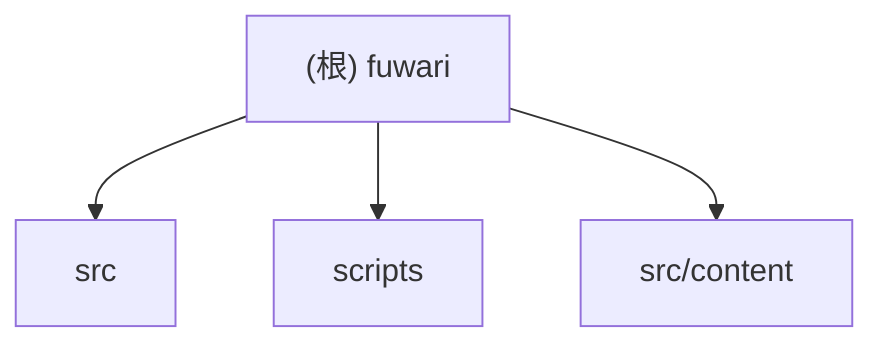

# fuwari 架构索引

## 变更记录 (Changelog)
- 2026-03-06 11:22:44：初始化项目架构文档（根级简明 + 模块级详尽），新增模块索引、Mermaid 结构图、覆盖率与续扫建议。

## 项目愿景
fuwari 是一个基于 Astro 的内容型站点工程，核心目标是围绕博客/归档/友链/赞助/画廊等页面，提供稳定的静态站点输出，并通过脚本体系支持内容维护、资源治理与自动化处理。

## 架构总览
- 运行时框架：Astro（静态输出）+ Svelte 组件混合。
- 内容系统：`src/content` 使用 Astro Content Collections（`posts` + `spec`）。
- 页面层：`src/pages` 提供归档、文章路由、RSS、Sitemap、robots 等入口。
- 站点配置：`src/config.ts` 统一管理站点元信息、导航、外链与可观测性配置。
- 自动化脚本：`scripts` 负责新文章生成、图片清理/CDN 替换、链接检查、摘要生成等。

## 模块结构图

## 模块索引
| 模块 | 职责 | 语言 | 入口/关键文件 | 测试情况 | 文档 |
|---|---|---|---|---|---|
| `src` | 站点应用层（页面、布局、组件、插件、工具） | TypeScript/Astro/Svelte | `src/pages/[...page].astro`, `src/layouts/MainGridLayout.astro`, `src/config.ts` | 未发现专门测试目录 | `src/CLAUDE.md` |
| `src/content` | 内容域（文章、公告、内容 schema、素材） | Markdown/TypeScript/JSON | `src/content/config.ts`, `src/content/posts/*.md`, `src/content/spec/announcement.md` | 未发现内容校验测试 | `src/content/CLAUDE.md` |
| `scripts` | 运维与内容自动化脚本 | Node.js/Python | `scripts/new-post.js`, `scripts/clean-unused-images.js`, `scripts/cdnify-images.js` | 未发现脚本测试 | `scripts/CLAUDE.md` |

## 运行与开发
- 安装依赖：`pnpm install`
- 本地开发：`pnpm dev`
- 构建：`pnpm build`
- 预览：`pnpm preview`
- 类型检查：`pnpm type-check`
- 质量命令：`pnpm format`、`pnpm lint`

## 测试策略
当前仓库未见显式 `tests/**`、`__tests__/**`、`*.spec.*` 或 `*_test.go` 体系。建议采用：
- 页面与内容回归：基于关键路由与关键内容做构建后快照检查；
- 脚本回归：为高风险脚本（删除/批量改写）增加 dry-run 与 fixture 测试；
- 内容 schema 校验：在 CI 中固定执行内容集合校验与 frontmatter 规则检查。

## 编码规范
- 统一使用 Biome（`biome.json`）进行格式与 lint 约束。
- TypeScript 配置为严格基线（`tsconfig.json` extends `astro/tsconfigs/strict`）。
- 样式处理采用 Tailwind + PostCSS（`postcss.config.mjs`）。

## AI 使用指引
- 可使用 `scripts/generate-ai-summary.js` 批量为文章生成 AI 摘要块。
- 在执行会写回文件或删除资源的脚本前，应先确认扫描结果非空并先本地备份。
- 建议将 AI 产物限定在内容层（`src/content/posts`），避免直接改动构建核心配置。

## 变更记录 (Changelog)
- 2026-03-06 11:22:44：
  - 新建根级架构文档；
  - 新增模块 Mermaid 结构图与模块索引；
  - 记录运行/测试/规范/AI 使用建议；
  - 建立与模块级 `CLAUDE.md` 的跳转关系。
